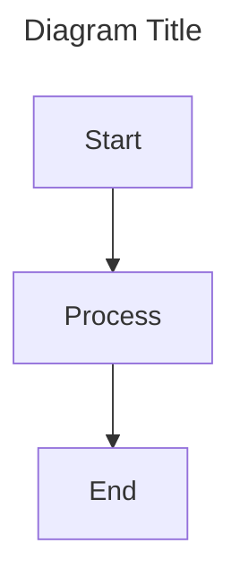

# Atlas Vivo Diagrams

This directory contains Mermaid diagrams for the Atlas Vivo ecosystem.

## Available Diagrams

- [architecture.mermaid](./architecture.mermaid) - System architecture showing integration with Codeberg, Zenodo, ORCID, and Portuguese state systems

## Usage

### Viewing Diagrams

1. **GitHub**: Mermaid diagrams render automatically in GitHub markdown preview
2. **Local**: Use VS Code with Mermaid extension or [Mermaid Live Editor](https://mermaid.live/)
3. **Documentation**: Include diagrams in markdown files using triple backtick mermaid code blocks

### Adding New Diagrams

1. Create a new .mermaid file in this directory
2. Use the following template:

3. Commit and push changes

### Synchronization

This directory is automatically synchronized with local filesystem and Codeberg repositories.

## License

All diagrams are licensed under **EUPL-1.2** (European Union Public Licence v1.2).

## Contact

For questions or issues, contact: milk@associacaomilk.pt
