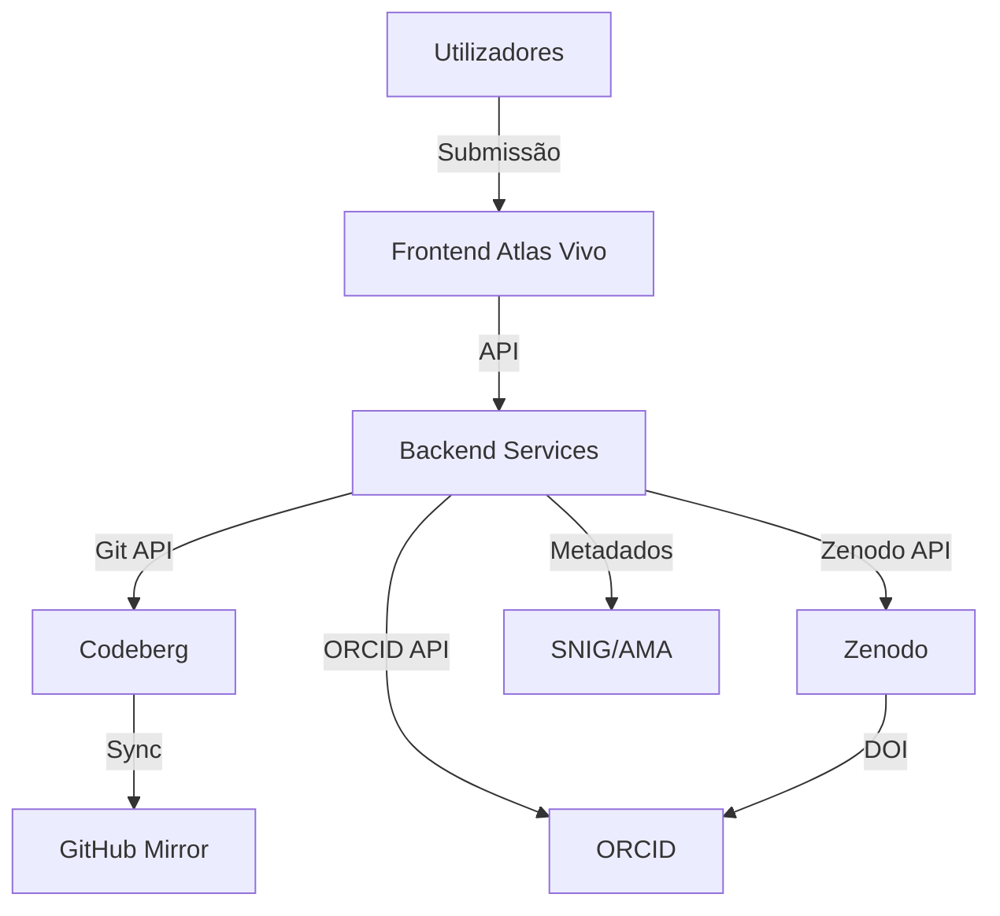

DOCUMENTAÇÃO TÉCNICA - AI ACT
**Sistema: Atlas Vivo**
**Associação MILK - Movimento de Intervenções e Linguagens Kulturais e Arte**
**NIPC: 518706451**

---

## 3. DESCRIÇÃO TÉCNICA DO SISTEMA

### 3.1. Arquitetura do Sistema

**Nota:** Diagrama de arquitetura do Atlas Vivo - sincronizado automaticamente em 2026-07-23T14:04:10.558Z

---

**Documento sincronizado automaticamente pelo Vibe Work Agent**
**Data de sincronização:** 2026-07-23T14:04:10.565Z
**Versão:** 1.0.0
