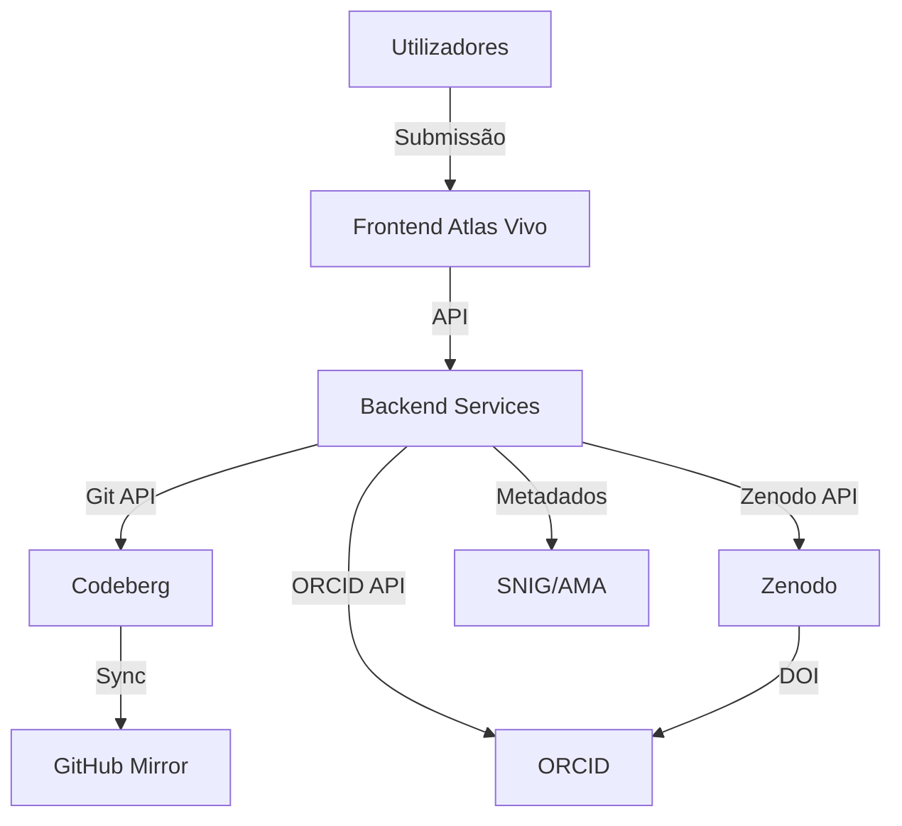

# DOCUMENTAÇÃO TÉCNICA - AI ACT
Sistema: Atlas Vivo
Associação MILK - Movimento de Intervenções e Linguagens Kulturais e Arte
NIPC: 518706451

---

## 1. IDENTIFICAÇÃO DO SISTEMA

| Campo | Valor |
|-------|-------|
| Nome do Sistema | Atlas Vivo |
| Fornecedor | Associação MILK |
| NIPC | 518706451 |
| Versão | 1.1.0 |
| Data de Lançamento | 2026-06-25 (versão inicial), 2026-07-10 (atualização) |
| Classificação AI Act | Alto Risco (Anexo III, ponto 1) |
| Categoria | Gestão e operação de infraestruturas críticas (dados geospaciais para políticas públicas) |

---

## 3. DESCRIÇÃO TÉCNICA DO SISTEMA

### 3.1. Arquitetura do Sistema

### 3.2. Componentes do Sistema

| Componente | Função | Tecnologia | Localização |
|-----------|--------|------------|------------|
| Frontend | Interface de utilizador | HTML/CSS/JS | Codeberg Pages |
| Backend | Lógica de negócio | Python/Node.js | Codeberg CI |
| Repositórios | Armazenamento de código | Git | Codeberg, GitHub |
| Datasets | Armazenamento de dados | Zenodo | CERN, Suíça |
| Identificação | Gestão de investigadores | ORCID | EUA |
| Metadados | Registo oficial | SNIG, AMA | Portugal |

---

## 11. VERSÃO E HISTÓRICO

| Versão | Data | Alterações | Responsável |
|--------|------|-----------|-------------|
| 1.0 | 2026-06-25 | Versão inicial | Vibe Work Agent |
| 1.1 | 2026-07-10 | Atualização de diagramas Mermaid e sincronização com GitHub | Vibe Work Agent |

---

Documento gerado automaticamente pelo Vibe Work Agent
Data de geração: 2026-07-10
Próxima revisão: 2027-01-10
Classificação: CONFIDENCIAL - Apenas para uso interno da Associação MILK