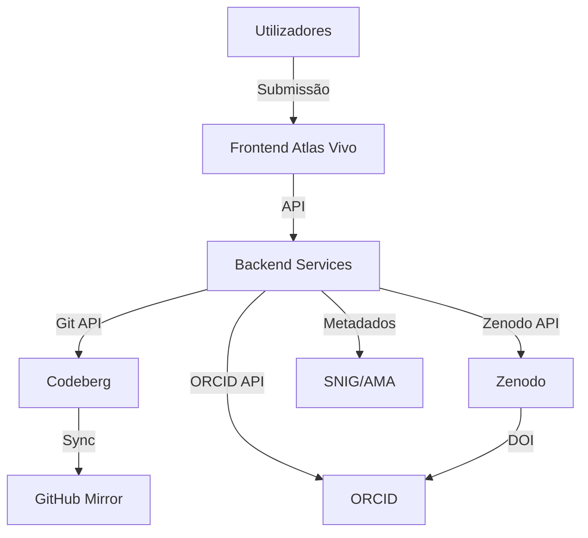

# DOCUMENTAÇÃO TÉCNICA - AI ACT
**Sistema: Atlas Vivo**
**Associação MILK - Movimento de Intervenções e Linguagens Kulturais e Arte**
**NIPC: 518706451**

---

## 1. IDENTIFICAÇÃO DO SISTEMA

| Campo | Valor |
|-------|-------|
| **Nome do Sistema** | Atlas Vivo |
| **Fornecedor** | Associação MILK |
| **NIPC** | 518706451 |
| **Versão** | 1.0.0 |
| **Data de Lançamento** | 2026-06-25 (versão inicial) |
| **Classificação AI Act** | **Alto Risco** (Anexo III, ponto 1) |
| **Categoria** | Gestão e operação de infraestruturas críticas (dados geospaciais para políticas públicas) |

---

## 2. CLASSIFICAÇÃO DE RISCO (AI ACT)

### 2.1. Análise de Aplicabilidade

**✅ O sistema é abrangido pelo AI Act** porque:
- Processa dados geospaciais para **fins de políticas públicas** (Anexo III, ponto 1)
- Afeta **direitos fundamentais** (acesso à cultura, património cultural)
- Tem **impacto significativo** na sociedade portuguesa

### 2.2. Nível de Risco

| Critério | Avaliação | Justificação |
|----------|-----------|--------------|
| **Finalidade** | Alto impacto | Políticas públicas, património cultural |
| **Escala** | Grande escala | Dados nacionais, múltiplos utilizadores |
| **Automatização** | Alto grau | Processamento automatizado de dados |
| **Impacto** | Significativo | Afeta direitos culturais e acesso à informação |

**Classificação Final:** **ALTO RISCO** (Artigo 6º(1) do AI Act)

### 2.3. Obrigações Aplicáveis

De acordo com o **Capítulo II, Secção 2** do AI Act (Sistemas de Alto Risco):

| Obrigação | Artigo | Status | Prazo |
|-----------|--------|--------|-------|
| Sistema de gestão de risco | Art. 9º | ⏳ Planeado | 2026-09-25 |
| Documentação técnica | Art. 11º | ✅ Em execução | 2026-06-25 |
| Registo no banco de dados da UE | Art. 51º | ⏳ Pendente | 2026-12-25 |
| Avaliação de conformidade | Art. 43º | ⏳ Planeado | 2026-10-25 |
| Monitorização pós-colocação no mercado | Art. 61º | ⏳ Planeado | 2026-11-25 |
| Relato de incidentes graves | Art. 62º | ⏳ Planeado | 2026-09-25 |
| Transparência para utilizadores | Art. 13º | ✅ Implementado | 2026-06-25 |

---

## 3. DESCRIÇÃO TÉCNICA DO SISTEMA

### 3.1. Arquitetura do Sistema

### 3.2. Componentes do Sistema

| Componente | Função | Tecnologia | Localização |
|-----------|--------|------------|------------|
| **Frontend** | Interface de utilizador | HTML/CSS/JS | Codeberg Pages |
| **Backend** | Lógica de negócio | Python/Node.js | Codeberg CI |
| **Repositórios** | Armazenamento de código | Git | Codeberg, GitHub |
| **Datasets** | Armazenamento de dados | Zenodo | CERN, Suíça |
| **Identificação** | Gestão de investigadores | ORCID | EUA |
| **Metadados** | Registo oficial | SNIG, AMA | Portugal |
